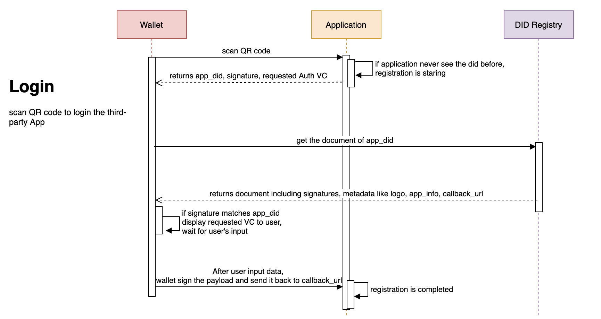

# ThoughtWorks DID

This document is the ThoughtWorks DID specification.

## Table of Contents
  - [Abstract](#abstract)
  - [Motivation](#motivation)
  - [DID](#did)
    - [DID Definition](#did-definition)
    - [DID Document](#did-document)
    - [Create DID](#create-did)
    - [Read DID](#read-did)
    - [Update DID](#update-did)
    - [Revoke DID](#revoke-did)
    - [Privacy considerations](#privacy-considerations)
    - [Security considerations](#security-considerations)
  - [Verifiable Credential](#verifiable-claims)
    - [VC Definition](#vc-definition)
  - [Use Cases](#use-cases)
    - [Authentication](#authentication)
    - [Issue Claims](#issue-claims)
    - [Verify Claims](#verify-claims)
## Abstract

## Motivation
[企业和用户关于隐私数据博弈的均衡点——自主身份](https://insights.thoughtworks.cn/self-sovereign-identity/)

[Self-Sovereign Identity — The Equilibrium Point of the Personal Identity Information Game](https://medium.com/@lambetaX/the-contradiction-that-the-decentralized-identity-try-to-solve-c90838d357d8) 

## DID

### DID Definition
DID is a globally unique identifier that does not require a centralized registration authority because it is registered with distributed ledger technology (DLT) or other form of decentralized network. 

```
did:tw:12AE66CDc592e10B60f9097a7b0D3C59fce29876

did       -> URL scheme identifier
tw        -> Identifier for the DID method
12AE66CDc592e10B60f9097a7b0D3C59fce29876 -> DID method-specific identifier is a checksumed address in Etheruem.
```

### DID Document
A DID document is the resource that is associated with a decentralized identifier (DID) that is presented as [JSON-LD] (https://www.w3.org/TR/did-core/#bib-json-ld). DID documents typically express verification methods (such as public keys) and services that can be used to interact with a DID controller.

### Create DID
```json
POST /dids

{
  "did": "did:tw:12AE66CDc592e10B60f9097a7b0D3C59fce29876",
  "publicKey": "0440b3fa8e848297ff26b04088263101fa87d3541ac48bbc32fe7b77b73246578241236ab6097d4012ac17a514272a54a7b728790e914bbbff431e49d421aa1eef" ,
  "signature": "54CnhKVqE63rMAeM1b8CyQjL4c8teS1DoyTfZnKXRvEEGWK81YA6BAgQHRah4z1VV4aJpd2iRHCrPoNTxGXBBoFw"
}
```
Returns `201`
### Read DID
```json
GET /dids/{did}
```
Returns `200` with Document Object in JSON-LD format
```json
{
  "@context": "https://www.w3.org/ns/did/v1",
  "id": "did:tw:12AE66CDc592e10B60f9097a7b0D3C59fce29876",
  "created":"2020-04-20T10:27:27.326Z",
  "publicKeys": [
	{
	  "id": "did:tw:12AE66CDc592e10B60f9097a7b0D3C59fce29876#keys-1",
	  "type": "Secp256k1",
	  "publicKey": "0440b3fa8e848297ff26b04088263101fa87d3541ac48bbc32fe7b77b73246578241236ab6097d4012ac17a514272a54a7b728790e914bbbff431e49d421aa1eef"
	}]
}
```

### Update DID
```json
PUT /dids/{did}
{
  "publicKey": "0189140b3fa8e848297ff26b04088263101fa87d3541ac48bbc32fe7b77b73246578241236ab6097d4012ac17a514272a54a7b728790e914bbbff431e49d421aa1f12",
  "signatures": [
    {
        "id":"did:tw:12AE66CDc592e10B60f9097a7b0D3C59fce29876#keys-1",
        "type":"Secp256k1",
        "signature":"54CnhKVqE63rMAeM1b8CyQjL4c8teS1DoyTfZnKXRvEEGWK81YA6BAgQHRah4z1VV4aJpd2iRHCrPoNTxGXBBoFw"
    },
    {
        "id":"did:tw:12AE66CDc592e10B60f9097a7b0D3C59fce29876#keys-2",
        "type":"Secp256k1",
        "signature":"26kkhZbQLSNvEKbPvx18GRfSoVMu2bDXutvnWcQQyrGxqz5VKijkFV2GohbkbafPa2WqVad7wnyLwx1zxjvVfvSa"
    }
  ]
}
```
Returns `200` with Document Object
```json
{
  "@context": "https://www.w3.org/ns/did/v1",
  "id": "did:tw:12AE66CDc592e10B60f9097a7b0D3C59fce29876",
  "created":"2020-04-20T10:27:27.326Z",
  "updated":"2020-04-20T12:30:20.326Z",
  "publicKeys": [
	{
	  "id": "did:tw:12AE66CDc592e10B60f9097a7b0D3C59fce29876#keys-1",
	  "type": "Secp256k1",
	  "publicKey": "0189140b3fa8e848297ff26b04088263101fa87d3541ac48bbc32fe7b77b73246578241236ab6097d4012ac17a514272a54a7b728790e914bbbff431e49d421aa1f12"
	}
  ]
}
```

### Revoke DID
```json
DELETE /dids/{did}
{
  "signatures": [
	{
	 "id":"did:tw:12AE66CDc592e10B60f9097a7b0D3C59fce29876#keys-2",
	 "type":"Secp256k1",
	 "signature":"26kkhZbQLSNvEKbPvx18GRfSoVMu2bDXutvnWcQQyrGxqz5VKijkFV2GohbkbafPa2WqVad7wnyLwx1zxjvVfvSa"
	}
  ]
}
```
Returns `204`

### Privacy considerations

- Verifier can verify holder's claim to check if the issuer issue the claim to the holder. That means holder will give a signature to verifier and issuer should sign the claim.
- Issuer can verify holder's DID to check he/she’s identity. That means holder will give a signature of DID to issuer.
- Holder can verify issuer's DID to check issuer's identity. That means issuer should register DID in the blockchain and give a signature to holder.
- Holder can verify Verifier's DID to check Verifier's identity. That means Verifier should register DID in the blockchain and give a signature to holder.
- Claim is encrypted and only holder can decode it. Verifier might get the claim and verify it, it's better to have a mechanism to verify claim without get the privacy information.


### Security considerations


## Verifiable Credential
Verifiable Credential is a set of one or more claims/assertions. It has `Metadata`, `Claim` and `Proof` properties. A alumniCredential, for example, the Metadata of it could include the credential's type, issuer, issue time, etc. A Claim could be **who is a alumni of an University** and the University then sign the credential in digital to give a proof for later verify.


### VC Definition
Verifiable Credential follows the [JWT standard](https://tools.ietf.org/html/rfc7519).
```
header.payload.signature
```
#### Header
```
{
  "alg": "ES256",
  "typ": "JWT"
}
```
* alg: the signing algorithm
  - ES256 - ECDSA with SHA256, with Curve secp256k1, P-256, etc...
  - ES224 - ECDSA with SHA224,
  - ES384 - ECDSA with SHA384,
  - ES512 - ECDSA with SHA512,
  - ES3-224 - ECDSA with SHA3 224
  - ES3-256 - ECDSA with SHA3 256
  - ES3-384 - ECDSA with SHA3 384
  - ES3-512 - ECDSA with SHA3 512
  - ER160 - ECDSA with RIPEMD160
  - SM - SM2 with SM3
  - EDS512 - EDDSA with SHA256
  
* typ: the type of Token
	* JWT: JSON Web Token (JWT) is an open standard (RFC 7519) that defines a compact and self-contained way for securely transmitting information between parties as a JSON object.
    
#### Payload
```
{
   "@context": ["https://www.w3.org/2018/credentials/v1",
   "https://blockchain.thoughtworks.cn/credentials/v1"],
   "id": "xyzxyzxyz",
   "ver": "0.7.0",
   "iss": "did:tw:f340A40E197c77979bE698401fd03251741137eE",
   "iat": 1588059342,
   "exp": 1651131342,
   "typ": ["VerifiableCredential", "HealthyCredential"],
   "sub": {
     "id": "did:tw:12AE66CDc592e10B60f9097a7b0D3C59fce29876",
     "healthyStatus": {
       "typ": "HealthyStatus",
       "val": "HEALTHY"
     }
   }
}
```

#### Signature
JWT Digital Signature is way to give a proof for the verifiable credential.
```
signature = Base64(ECDSASHA256(Base64(header).Base64(payload), pubkey, prikey))
```

## Use Cases

### Authentication


### Issue Claims


### Verify Claims

